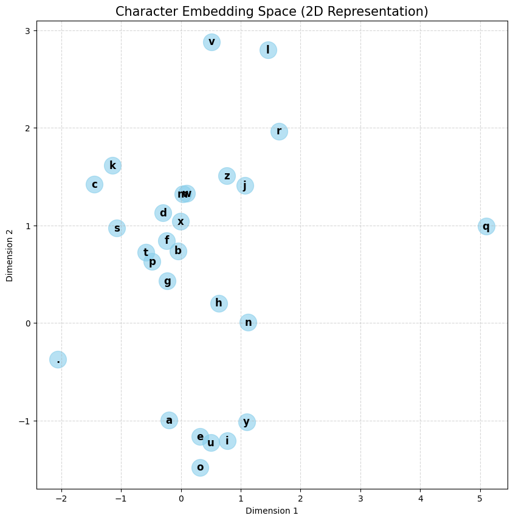

# 🛡️ Trigram Neural Network: Sequence Predictor

  
  
  
  

A character-level language model built from scratch using PyTorch. This project moves beyond simple Bigram models to implement a **Trigram** architecture with a two-character context window, designed to predict and generate name/password-like sequences.

## 🚀 Key Features
- **Trigram Context Window:** Utilizes $n-1$ (two) previous characters to predict the third, providing significantly higher structural accuracy than Bigram models.
- **Learned Embeddings:** Maps characters into a 2D vector space, allowing the model to "learn" phonetic relationships (e.g., vowels vs. consonants) geometrically.
- **Custom MLP Architecture:** Implements a hidden layer with 100 neurons and Tanh activation functions.
- **Interactive Predictor:** Includes a Google Colab-based UI for real-time sequence completion.

## 📊 Technical Performance
| Metric | Value |
| :--- | :--- |
| **Initial Random Loss** | ~3.32 |
| **Final Optimized Loss** | 2.28 |
| **Vocabulary Size** | 27 Characters |
| **Embedding Dimensions** | 2 |

## 🧠 What the Model Learned
The visualization below shows the character embedding space after training. Notice how vowels (a, e, i, o, u) have clustered together, proving the model understands their interchangeable role in sequence formation.

## 🛠️ How to Use
1. Open the `.ipynb` file in Google Colab.
2. Run the initialization and training cells.
3. Use the **Interactive Predictor** form to input a 2-character prefix (e.g., "ma", "th", "st") and watch the model generate the rest.
