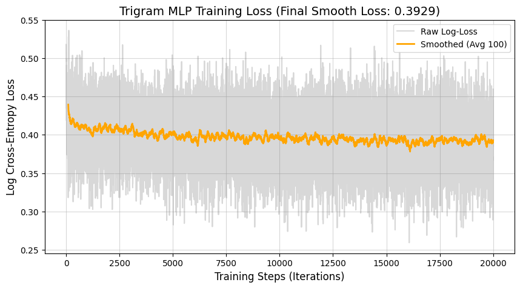
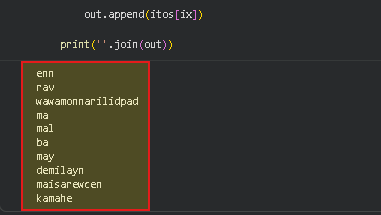

# <h1 align="center">Trigram Neural Network: Sequence Predictor</h1>

  
  
  
  

A character-level language model built from scratch using PyTorch. This project moves beyond simple Bigram models to implement a **Trigram** architecture with a two-character context window, designed to predict and generate name/password-like sequences trained on a dataset of 32,000+ names (228k+ training examples)..

## Key Features
- **Trigram Context Window:** Utilizes $n-1$ (two) previous characters to predict the third, providing significantly higher structural accuracy than Bigram models.
- **Learned Embeddings:** Maps characters into a 2D vector space, allowing the model to "learn" phonetic relationships (e.g., vowels vs. consonants) geometrically.
- **Custom MLP Architecture:** Implements a hidden layer with 100 neurons and Tanh activation functions.
- **Interactive Predictor:** Includes a Google Colab-based UI for real-time sequence completion.

## Architecture & Methodology
The model follows the architecture proposed by Bengio et al. (2003), scaled for character-level linguistics:
1. Embedding Layer: Maps 27 characters into a 2D latent space.
2. Flattening: Concatenates context embeddings into a single input vector.
3. Hidden Layer: A 300-neuron "Engine Room" using tanh activation to detect complex phonetic patterns.
4. Output Layer: A 27-way linear layer (Logits) followed by a Softmax distribution.

## Technical Performance
| Metric | Value |
| :--- | :--- |
| **Initial Random Loss** | ~3.32 |
| **Final Optimized Loss** | 2.28 |
| **Vocabulary Size** | 27 Characters |
| **Embedding Dimensions** | 2 |

## What the Model Learned
The visualization below shows the character embedding space after training. Notice how vowels (a, e, i, o, u) have clustered together, proving the model understands their interchangeable role in sequence formation.

## Technical Challenges: The "Confidently Wrong" Bug
- During development, the model initially showed an abnormally high loss (~17.0). 
- Through diagnostic testing, I identified a double-initialization error where the weights were being reset with high-variance random numbers.
- By "quieting" the weights ($W2 \times 0.01$) and centering the biases, I achieved a baseline random loss of ($~3.3$), which allowed the gradient descent to converge much more effectively to a final loss of 2.28.

## Advanced Insights: Phonetic Discovery
To improve model accuracy, I scaled the architecture from a 2-dimensional embedding to a **10-dimensional latent space**. To maintain interpretability, I utilized **PCA (Principal Component Analysis)** to project these high-dimensional relationships back into a 2D visualization.

### Key Discovery: The "Sometimes Y" Rule
A notable result of the training process was the autonomous clustering of the letter **'y'** within the vowel group (a, e, i, o, u). 

Without explicit linguistic programming, the model identified that 'y' shares statistical contexts with vowels in the English names dataset. This demonstrates the model's ability to capture nuanced phonetic patterns through gradient descent.

## Convergence Analysis
The model was trained for 20,000 iterations using Stochastic Gradient Descent (SGD).

Final Log-Loss: 0.3929

Final Raw Cross-Entropy: ~2.47
The loss curve shows a classic "plateau" effect, indicating that the model successfully captured the primary phonetic rules of the dataset.

## Model Inference & Sample Output
After training for 20,000 iterations, the model was tasked with generating new names by sampling from the learned probability distributions.

Sample Results:
- Phonetic Successes: enn, rav, may, mal, kamahe
- Creative Generalization: demilayn, maisarewcen
- The "Infinite Loop" Phenomenon: wawamonnarilidpad

### Technical Analysis of Output:
The model excels at local phonetic transitions (e.g., knowing that d often follows l in demilayn). 

However, because the Trigram context is only 2 characters wide, the model lacks "Global Memory." 

It can get stuck in high-probability loops (like wa-wa-mon...) because it doesn't "remember" how long the name has already become. 

**This is a characteristic limitation of fixed-window MLPs.**

## How to Use
1. Open the `.ipynb` file in Google Colab.
2. Run the initialization and training cells.
3. Use the **Interactive Predictor** form to input a 2-character prefix (e.g., "ma", "th", "st") and watch the model generate the  rest.
